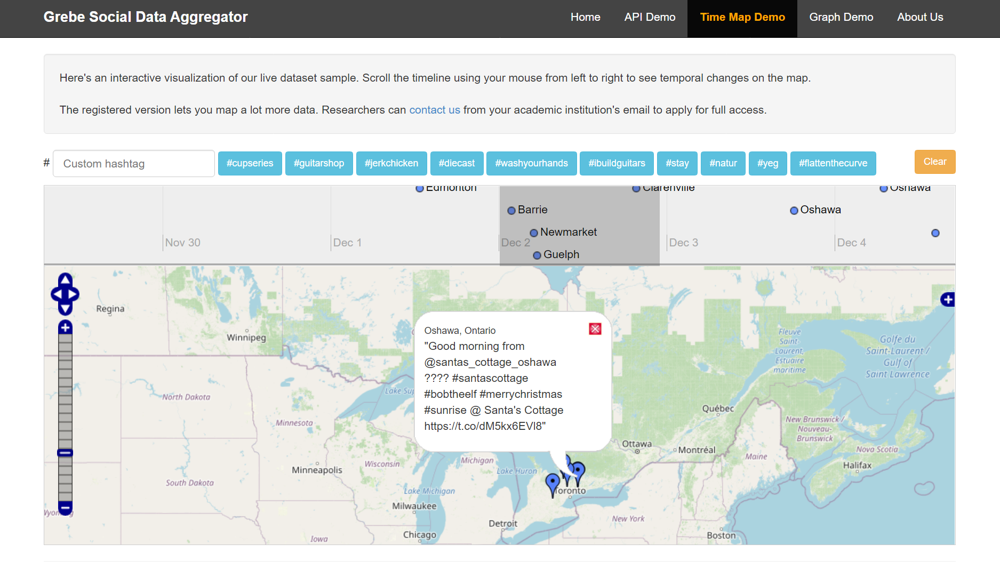

## Grebe Social Data Aggregator [](https://www.gnu.org/licenses/agpl-3.0)

Grebe aggregates geo-fenced Canadian Twitter data for research in sociology and public health. View our [__demo__](http://199.116.235.207/grebe) to see how the data collected by Grebe can be analyzed and visualized in various ways.

Please cite the following [publication](https://ieeexplore.ieee.org/document/8609598) when using our source code for your research.

```
@inproceedings{SamuelNooriFaraziZaiane2018,
  title = {{Context Prediction in the Social Web Using Applied Machine Learning: A Study of Canadian Tweeters}},
  author = {Samuel, Hamman and Noori, Benyamin and Farazi, Sara and Zaiane, Osmar},
  booktitle = {IEEE/WIC/ACM International Conference on Web Intelligence (WI)},
  pages = {230--237},
  year = {2018},
  organization = {IEEE}
}
```

# Demo

A working [live web app](http://199.116.235.207/grebe) is available for demo purposes.



## Prerequisites

1. For hosting, you can use IaaS with [Cybera](http://www.cybera.ca) or [Digital Ocean](https://www.digitalocean.com), PaaS with [OpenShift](https://www.openshift.com) or [Heroku](https://www.heroku.com), or just use your laptop/computer (not recommended due to space and processing limitations).
2. Install [Python](https://www.python.org/downloads).
3. Install [Flask](http://flask.pocoo.org/) by using `pip install flask`.
4. Install Flask's HTTP Auth dependency via `pip install flask-httpauth`.
5. Install [TwitterAPI](https://github.com/geduldig/TwitterAPI) via `pip install TwitterAPI`.
6. Install [MariaDB](https://mariadb.com/downloads).
7. Run the SQL commands in `schema.sql` to set up a database.
8. Edit `config.py` to enter your database username and password.
9. Install the MySQL Connector via `pip install mysql-connector`.
10. Install Python MySQL Connector by using `pip install mysql-connector-python-rf`.

## Workflow

1. Aggregate tweets by running `spyder.py`.
2. Initialize cache by running `scripts/cacher.py`.
3. View web app by running `webapp/server.py`.

## Aggregating Tweets

1. Sign up for a [Twitter Developer](http://developer.twitter.com/) account.
2. Set up your [Twitter API keys](http://iag.me/socialmedia/how-to-create-a-twitter-app-in-8-easy-steps/).
3. Edit `config.py` and enter your API keys.
4. In a terminal, use the following command to run the aggregator `python spyder.py [status | search | stream]`.
5. If you want to aggregate data automatically, set up instances of the command above to run at scheduled intervals, for example as a cron job or Task Scheduler.

## Initializing Cache

1. To visualize and display data faster in the web app, the cache directory is set in `config.py` as `HOME_DIR`.
2. To set up the cache, run `python cacher.py [data tags stats]` from the `scripts` folder.
3. Clean up your cache directory regularly so it doesn't fill your drive, a sample _bash_ script is provided here that can be set up to run regularly (replace `HOME_DIR` with the actual path to your directory).

```
#!/bin/bash
LIMIT="1000000" # 1GB
SIZE=$(du --apparent-size HOME_DIR | cut -f1)
if (($SIZE > $LIMIT))
then
    rm -f HOME_DIR/*
    echo "Cache cleared"
else
    echo "Cache preserved"
fi
```

## Viewing Web App

- In a terminal from the `webapp` folder, use the command `python server.py` to run the Flask server.
- In your web browser, go to [http://127.0.0.1:5000/grebe/](http://127.0.0.1:5000/grebe/)
- When using IaaS hosting, you can serve the Flask web app using [uWSGI](https://www.digitalocean.com/community/tutorials/how-to-serve-flask-applications-with-uwsgi-and-nginx-on-ubuntu-16-04).
- PaaS hosting configurations depend on the provider, but here is one for [Heroku](https://medium.com/the-andela-way/deploying-a-python-flask-app-to-heroku-41250bda27d0).